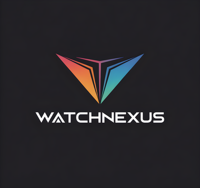

<!--
  WatchNexus — Production README
  Ships alongside every installer; copied into stage/<tier>/ by prepare-installers.sh.
-->

<p align="center">
  
</p>

<h1 align="center">WatchNexus</h1>

<p align="center">
  <strong>Release To Public — RTP v1.0.1</strong><br>
  A unified, self-hosted media server with tier-locked module licensing.
</p>

<p align="center">
  <a href="https://watchnexus.ca">Website</a> ·
  <a href="https://docs.watchnexus.ca">Documentation</a> ·
  <a href="https://licenses.watchnexus.ca">License Portal</a> ·
  <a href="CHANGELOG.md">Changelog</a>
</p>

---

## What is WatchNexus?

WatchNexus is a C#/.NET 10 + React 18 media server that consolidates the
*arr stack, Jellyfin-style playback, Jellyseerr-style discovery, retro
gaming, ebook/audiobook management, live-TV DVR, hardware transcoding,
and cloud sync into **one cohesive product**. It is licensed in three
tiers — **Standard**, **Pro**, **Ultra** — with physical, tier-specific
installers so a Standard install never ships Pro/Ultra binaries.

## Tier overview

| Tier      | Modules | Highlights |
|-----------|---------|------------|
| Standard  | 31      | Libraries, playback, scrobbling, discovery, weather, podcasts, radio, photos, basic settings |
| Pro       | +18 (49 total) | *arr automation (Fondue/Saffron/Sprout), backups (Sourdough), download clients (Churro), collections (Roux), live TV DVR, analytics |
| Ultra     | +24 (73 total) | Bastion 2FA, Tunnel VPN, Strudel rip pipeline, hardware transcoding, Parfait/Menu discovery, Chowder sync, Pretzel emulator, S3 backup, cloud sync |

A complete module matrix lives in [`docs/TIER-MANIFESTS.md`](docs/TIER-MANIFESTS.md).

## Installation

Pre-built installers for RTP v1.0.1 are published at
<https://releases.watchnexus.ca/RTP v1.0.1/>:

| Platform | File |
|---|---|
| Windows  | `watchnexus-<tier>-1.0.1-windows-x64.exe` |
| Fedora   | `watchnexus-<tier>-1.0.1-1.x86_64.rpm` |
| Debian   | `watchnexus-<tier>_1.0.1_amd64.deb` |
| Arch     | `watchnexus-<tier>-1.0.1-1-x86_64.pkg.tar.zst` |
| Docker   | `docker pull watchnexus/watchnexus:1.0.1-<tier>` |
| Unraid   | Community Apps → search "WatchNexus" |

After install, browse to `http://<host>:8001` and enter your license key
on the first-launch screen.

## First-launch checklist

1. Open `http://<host>:8001`.
2. Activate your license key (Standard / Pro / Ultra).
3. Settings → Libraries → add at least one media root.
4. Settings → Integrations → paste your **TMDB v3 API key**.
5. Settings → System → confirm Fortress integrity status is **Green**.
6. *(Pro/Ultra only)* Settings → Download Clients → connect Churro to
   qBittorrent / SABnzbd / NZBGet.
7. *(Ultra only)* Settings → Security → enable Bastion 2FA.

## Service management

| Platform | Command |
|---|---|
| Linux (systemd) | `sudo systemctl {start\|stop\|status\|restart} watchnexus` |
| Windows         | `services.msc` &rarr; `WatchNexusCore` |
| Docker          | `docker {start\|stop\|restart} watchnexus` |

Logs:

```bash
journalctl -u watchnexus -f          # Linux
docker logs -f watchnexus            # Docker
```

## Data layout

| Path | Purpose |
|---|---|
| `/var/lib/watchnexus/`     | Database (SQLite), thumbnails, transcode cache |
| `/var/lib/watchnexus/data` | Persistent user data (Linux/Docker) |
| `%PROGRAMDATA%\WatchNexus` | Same, on Windows |
| `/opt/watchnexus/`         | Installed binaries (Linux) |
| `C:\Program Files\WatchNexus\` | Installed binaries (Windows) |

Back up `/var/lib/watchnexus/data` regularly — that single directory
captures all user state.

## Upgrading

Updates flow from the license server:

* In-app: **Settings → Updates → Check now**.
* CLI / package manager: same as the original install method.

The Fortress integrity manifest is re-validated after every upgrade.

## Building from source

If you have access to the source tree, see
[`docs/INSTALLBUILDER-STEPS.md`](docs/INSTALLBUILDER-STEPS.md) for the
canonical step-by-step build procedure (Arch laptop &rarr; tier
staging &rarr; InstallBuilder 26 &rarr; signing &rarr; upload).

The full reference manual is [`docs/installbuilder.md`](docs/installbuilder.md).

## Support

| Channel | URL |
|---|---|
| Documentation | <https://docs.watchnexus.ca> |
| Issue tracker | <https://github.com/watchnexus/watchnexus/issues> |
| Email support | <support@watchnexus.ca> |
| License sales | <https://watchnexus.ca/pricing> |

## License

WatchNexus is proprietary software licensed per-tier. See
[`LICENSE.txt`](LICENSE.txt) or [`LICENSE.html`](LICENSE.html) for the
full End User License Agreement.

Third-party component notices: <https://watchnexus.ca/legal/notices>.

---

<p align="center"><sub>WatchNexus &middot; RTP v1.0.1 (RTP) &middot; Built with care for self-hosters.</sub></p>
