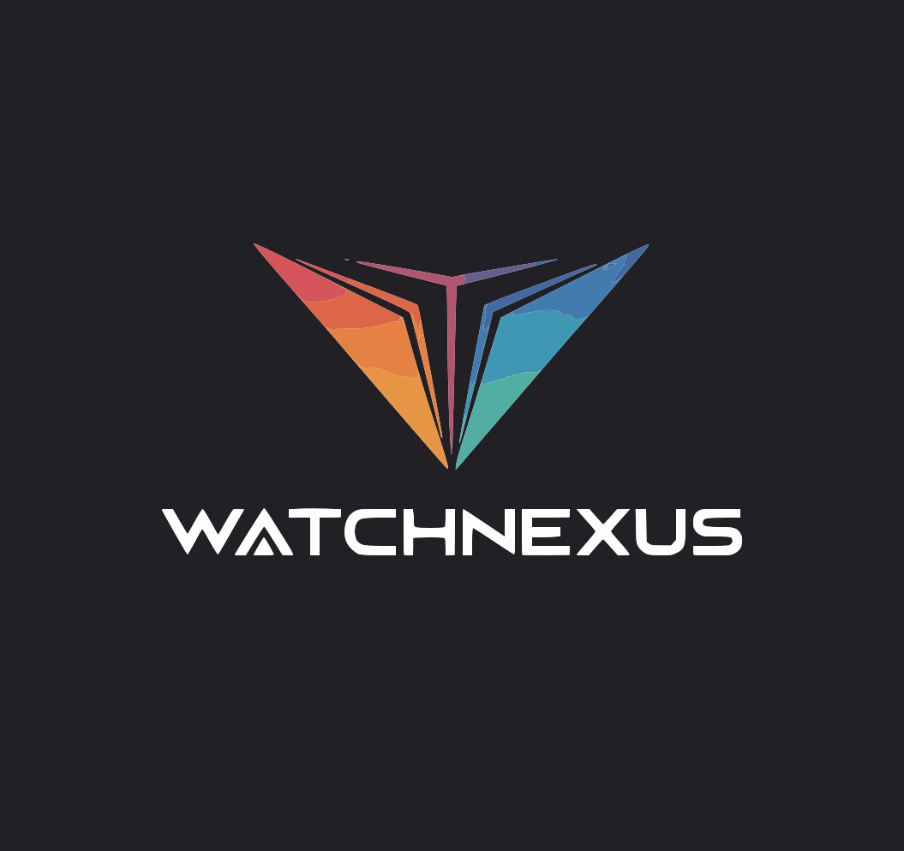

# WatchNexus

<p align="center">
  
</p>

<h3 align="center">🍯 Unified Media Pipeline</h3>

<p align="center">
  A self-hosted, all-in-one media automation platform that replaces Sonarr, Radarr, Prowlarr, qBittorrent, Bazarr, and Jellyfin.
</p>

<p align="center">
  <a href="#features">Features</a> •
  <a href="#modules">Modules</a> •
  <a href="#installation">Installation</a> •
  <a href="#usage">Usage</a> •
  <a href="#api">API</a> •
  <a href="#contributing">Contributing</a>
</p>

---

## ✨ Features

- **🎬 Unified Media Server** - Stream movies, TV shows, music, and audiobooks from one place
- **🔍 Smart Indexer Aggregation** - Search multiple torrent/usenet sources simultaneously  
- **⬇️ Built-in Download Engine** - No need for external torrent clients
- **📝 Automatic Subtitles** - Fetch subtitles from Addic7ed and OpenSubtitles
- **🎉 Watch Parties** - Synchronized viewing with friends (LAN + Internet)
- **🌐 Remote Access** - Access your media from anywhere with Gelatin tunneling
- **🎨 Customizable Themes** - 6 built-in themes + custom theme creator
- **🔌 Plugin System** - Extend functionality with custom plugins
- **📱 Cross-Platform** - Runs on Linux, macOS, and Windows

## 🍯 Modules

WatchNexus is built with a modular architecture using a food-themed naming convention:

| Module | Code Name | Description |
|--------|-----------|-------------|
| Media Server | **Marmalade** 🍊 | Library management, streaming, watch progress |
| Indexer Manager | **Compote** 🍇 | Central hub for indexers and scrapers |
| Indexer Aggregator | **Syrup** 🍯 | Live site scrapers (1337x, YTS, EZTV) |
| Challenge Solver | **Preserve** 🫙 | Cloudflare bypass protection |
| Usenet Handler | **Pulp** 🍊 | NZB/Usenet download management |
| Torrent Engine | **Fondue** 🫕 | Built-in libtorrent client |
| Subtitle Service | **Garnish** 🌿 | Addic7ed/OpenSubtitles integration |
| Watch Party | **Potluck** 🍲 | Synchronized viewing with chat |
| External Access | **Gelatin** 🍮 | LAN discovery & tunneling |
| Media Health | **Sieve** 🫗 | File validation and repair |
| Plugin System | **Gadgets** 🔧 | Extension framework |
| Theme Engine | **Milk** 🥛 | Visual customization |
| Color Picker | **Juice** 🧃 | Theme color selection |

## 📦 Installation

### Quick Install (Linux)

```bash
curl -fsSL https://raw.githubusercontent.com/watchnexus/watchnexus/main/scripts/install-linux.sh | sudo bash
```

### Platform-Specific Installation

#### Arch Linux
```bash
git clone https://github.com/watchnexus/watchnexus.git
cd watchnexus
./scripts/build-arch.sh
```

#### macOS
```bash
curl -fsSL https://raw.githubusercontent.com/watchnexus/watchnexus/main/scripts/install-mac.sh | bash
```

#### Windows (PowerShell as Admin)
```powershell
Set-ExecutionPolicy Bypass -Scope Process -Force
iwr -useb https://raw.githubusercontent.com/watchnexus/watchnexus/main/scripts/install-windows.ps1 | iex
```

### Manual Installation

1. **Prerequisites**
   - Python 3.11+
   - Node.js 18+
   - MongoDB 5+
   - FFmpeg

2. **Clone & Setup**
   ```bash
   git clone https://github.com/watchnexus/watchnexus.git
   cd watchnexus
   
   # Backend
   cd backend
   python -m venv venv
   source venv/bin/activate  # Windows: venv\Scripts\activate
   pip install -r requirements.txt
   
   # Frontend
   cd ../frontend
   yarn install
   ```

3. **Configure**
   ```bash
   # Backend .env
   cp backend/.env.example backend/.env
   # Edit with your settings
   
   # Frontend .env
   cp frontend/.env.example frontend/.env
   ```

4. **Run**
   ```bash
   # Terminal 1 - Backend
   cd backend && source venv/bin/activate
   uvicorn server:app --host 0.0.0.0 --port 8001
   
   # Terminal 2 - Frontend
   cd frontend && yarn start
   ```

5. **Access** at `http://localhost:3000`

## 🚀 Usage

### First-Time Setup

1. Open WatchNexus in your browser
2. Create an account or login with Google
3. Go to **Settings > Library** to add your media folders
4. Configure indexers in **Settings > Indexers**
5. Start browsing and streaming!

### Watch Party

1. Find a movie/show in your library
2. Click **Start Watch Party**
3. Share the party code with friends
4. Everyone syncs automatically!

### Theme Customization

1. Go to **Settings > Theme Forge**
2. Choose a built-in theme or create custom
3. Use the Juice color picker for fine-tuning
4. Save and apply instantly

## 🔌 API Reference

### Authentication
```bash
# Login
POST /api/auth/login
Body: { "email": "user@example.com", "password": "..." }

# Register
POST /api/auth/register
Body: { "email": "...", "password": "...", "username": "..." }
```

### Media Library (Marmalade)
```bash
# List libraries
GET /api/marmalade/libraries

# Add library
POST /api/marmalade/libraries
Body: { "name": "Movies", "path": "/media/movies", "media_type": "movies" }

# Get media
GET /api/marmalade/media?type=movies

# Stream media
GET /api/marmalade/stream/{media_id}/file
```

### Watch Party (Potluck)
```bash
# Create party
POST /api/watch-party/create?media_id=123&media_title=Movie&media_type=movie

# Join via WebSocket
WS /ws/party/{party_code}
```

### Subtitles (Garnish)
```bash
# Search TV subtitles
GET /api/subtitles/search/tv?show_name=Breaking%20Bad&season=1&episode=1

# Search movie subtitles
GET /api/subtitles/search/movie?movie_name=Inception&year=2010
```

### External Access (Gelatin)
```bash
# Get server status
GET /api/gelatin/status

# Create tunnel
POST /api/gelatin/tunnel/create

# Generate access token
POST /api/gelatin/access-token
```

### Themes (Milk)
```bash
# Get theme config
GET /api/milk/themes

# Set theme
POST /api/milk/set-theme
Body: { "type": "movie" }

# Get current CSS
GET /api/milk/css
```

## 🏗️ Project Structure

```
watchnexus/
├── backend/
│   ├── server.py           # FastAPI main app
│   ├── marmalade_server.py # Media server
│   ├── compote.py          # Indexer manager
│   ├── fondue.py           # Torrent engine
│   ├── garnish.py          # Subtitle service
│   ├── potluck.py          # Watch party
│   ├── gelatin.py          # External access
│   ├── sieve.py            # Media health
│   ├── gadgets.py          # Plugin system
│   ├── milk.py             # Theme engine
│   └── syrup_scrapers.py   # Live scrapers
├── frontend/
│   ├── src/
│   │   ├── pages/          # React pages
│   │   ├── components/     # UI components
│   │   │   └── juice/      # Color picker
│   │   └── services/       # API services
│   └── public/
├── scripts/
│   ├── build-arch.sh       # Arch build script
│   ├── install-linux.sh    # Linux installer
│   ├── install-mac.sh      # macOS installer
│   └── install-windows.ps1 # Windows installer
├── docs/
│   └── WN-SPLIT-STRUCTURE.md
└── memory/
    └── PRD.md
```

## 🤝 Contributing

We welcome contributions! See our [WN-Split Structure](docs/WN-SPLIT-STRUCTURE.md) for the modular repository layout.

### Development Setup

```bash
# Clone
git clone https://github.com/watchnexus/watchnexus.git
cd watchnexus

# Install dev dependencies
cd backend && pip install -r requirements-dev.txt
cd ../frontend && yarn install

# Run tests
cd backend && pytest tests/
cd ../frontend && yarn test
```

### Plugin Development

Create plugins using the Gadgets framework:

```python
from gadgets import GadgetPlugin, PluginType

class MyPlugin(GadgetPlugin):
    @property
    def name(self) -> str:
        return "My Plugin"
    
    @property
    def plugin_id(self) -> str:
        return "my-plugin"
    
    @property
    def plugin_type(self) -> PluginType:
        return PluginType.GENERAL
    
    async def initialize(self) -> bool:
        return True
    
    async def shutdown(self):
        pass
```

## 📄 License

MIT License - see [LICENSE](LICENSE) for details.

## 🙏 Acknowledgments

- Built with [FastAPI](https://fastapi.tiangolo.com/), [React](https://reactjs.org/), [libtorrent](https://libtorrent.org/)
- UI components from [shadcn/ui](https://ui.shadcn.com/)
- Animations by [Framer Motion](https://www.framer.com/motion/)
- Metadata from [TMDB](https://www.themoviedb.org/)

---

<p align="center">
  Made with 🍯 by the WatchNexus Team
</p>
