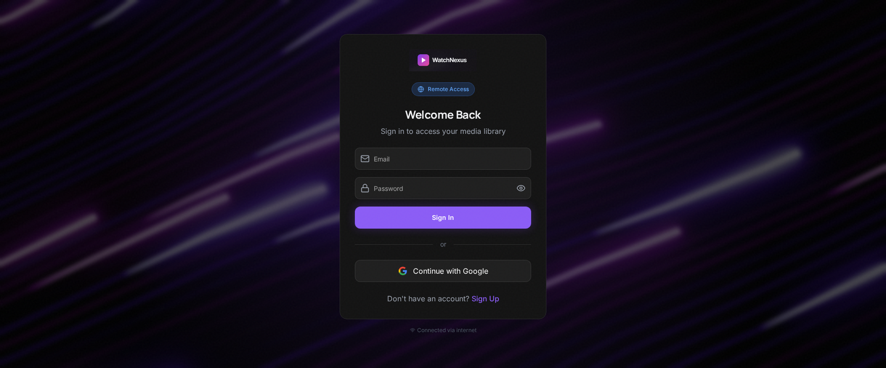
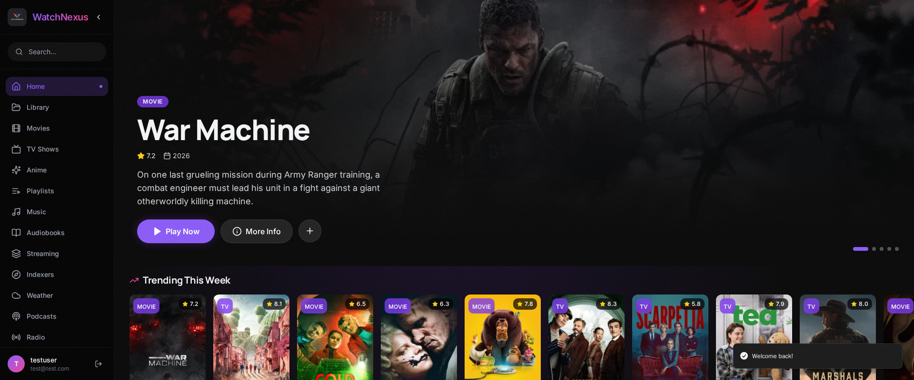
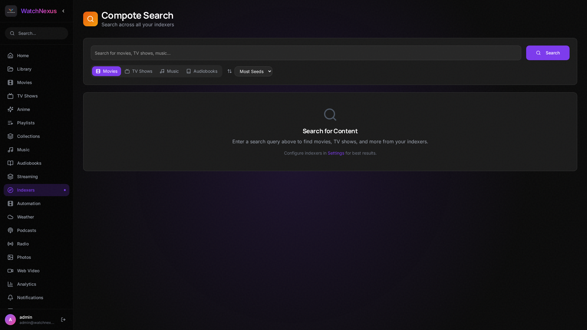
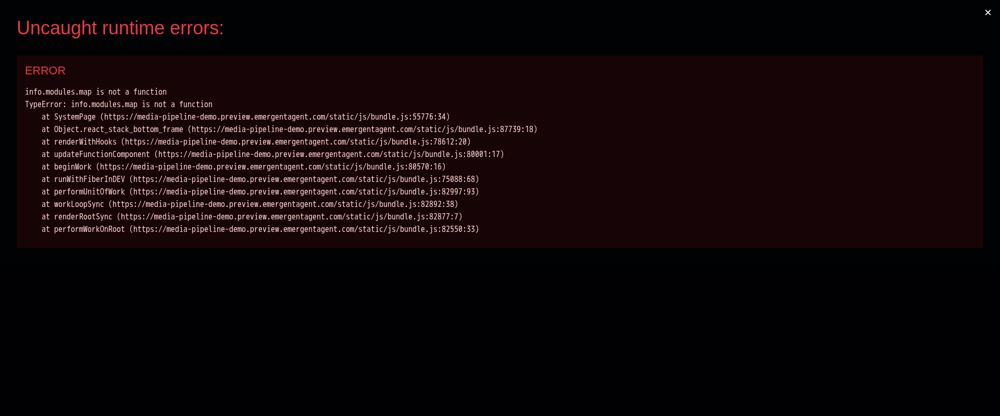
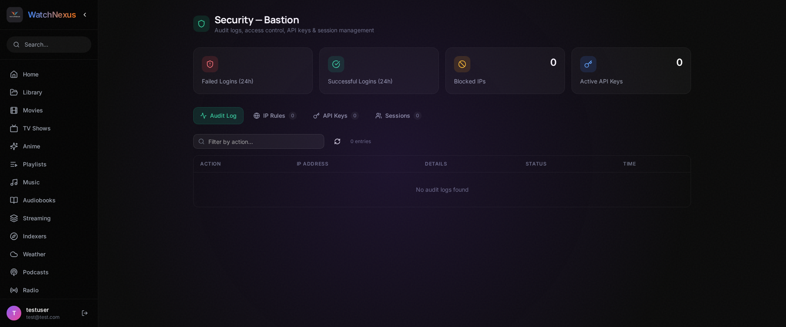
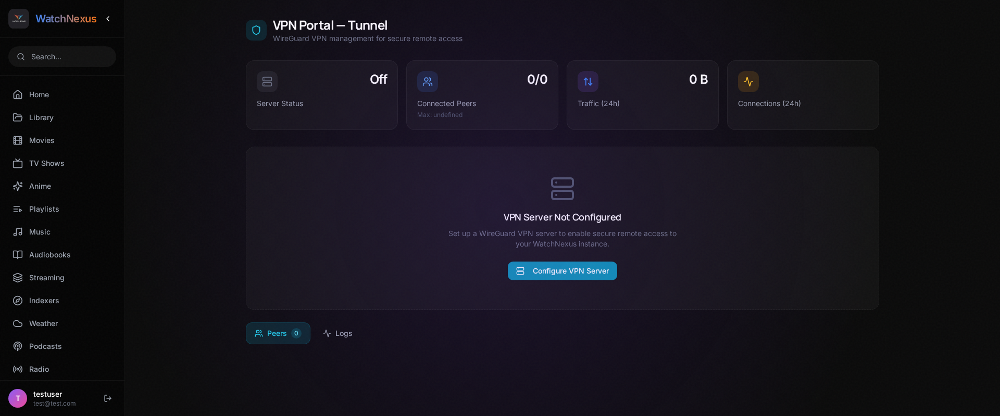

# WatchNexus Press Kit

## About WatchNexus

**WatchNexus** is a self-hosted, unified media management pipeline that combines the best of media servers like Jellyfin with the automation power of the *arr ecosystem -- all in a single application. Built with C#/.NET 10 and React, it gives users complete control over their media libraries without relying on third-party cloud services.

**Current Version:** 1.0.1  
**Platform:** Self-hosted (Linux, Windows, macOS, Docker)  
**License:** Proprietary  
**Website:** [watchnexus.ca](http://watchnexus.ca)

---

## Product Overview

WatchNexus eliminates the need to juggle multiple applications for media management. Instead of running separate services for library management, indexer search, downloads, transcoding, security, and playback, WatchNexus handles it all from a single, polished interface.

### Key Value Propositions

- **All-in-One:** Library management, content discovery, automated downloads, transcoding, and playback in one application
- **Self-Hosted:** Your data stays on your hardware. No cloud dependency, no subscriptions, no tracking
- **35 Integrated Modules:** From security (Bastion) to VPN management (Tunnel) to RSS feeds (Sprout) -- every feature is a first-class module
- **Production-Ready Security:** TOTP 2FA, JWT auth, IP filtering, API key management, session tracking, audit logging
- **Multi-Indexer Search:** Real-time search across Nyaa.si, YTS, EZTV, Torznab/Newznab, and generic RSS feeds with quality/codec detection
- **Beautiful Dark UI:** A carefully crafted interface built with React, TailwindCSS, and Shadcn UI components

---

## Feature Highlights

### Media Library (Marmalade)
Scan local directories, fetch rich metadata from TMDB, and organize your collection into Movies, TV Shows, and Anime. Continue watching with progress tracking across all devices on your network.

### Indexer Search Engine (Compote)
Search across multiple indexers simultaneously. Results include quality detection (4K/1080p/720p), codec info (HEVC/x264/AV1), file sizes, seeder counts, and one-click grab functionality with magnet link support.

### Security Center (Bastion)
Enterprise-grade security for a self-hosted application:
- Real TOTP two-factor authentication with QR code setup
- LDAP integration for centralized user management
- IP-based access rules
- API key management with granular permissions
- Full audit logging with search and export
- Active session monitoring with device/browser detection

### VPN Portal (Tunnel)
Built-in WireGuard VPN management:
- Peer CRUD with automatic key generation
- SSL certificate management
- Bandwidth monitoring with historical data
- Dynamic DNS and Tailscale support
- External connectivity testing

### Movie Automation (Fondue)
Radarr-like movie monitoring and automated acquisition:
- Add movies to your watchlist and let WatchNexus find and download them
- Quality profile matching
- Download queue management

### System Dashboard
Real-time server health monitoring showing:
- Runtime information (.NET version, architecture, uptime)
- 8 active security features with status indicators
- All 35 modules with version tracking
- Memory usage, CPU cores, and platform details

---

## Technical Specifications

| Component | Technology |
|-----------|------------|
| Backend | C#/.NET 10 (ASP.NET Core) |
| Frontend | React 18, TailwindCSS, Shadcn UI |
| Database | SQLite with Entity Framework Core 10 |
| Authentication | JWT Bearer Tokens + TOTP 2FA |
| Metadata | TMDB API |
| Downloads | qBittorrent Web API, Built-in torrent engine |
| Transcoding | FFmpeg pipeline |
| VPN | WireGuard |
| Security | Fortress (assembly integrity verification) |

### System Requirements

| Requirement | Minimum | Recommended |
|-------------|---------|-------------|
| RAM | 4 GB | 8 GB |
| Disk Space | 2 GB (+ media) | 10 GB (+ media) |
| OS | Linux (x64/arm64), Windows 10+, macOS 12+ | Linux (Ubuntu 22.04+) |
| Runtime | .NET 10 | Included in release builds |

---

## Module Ecosystem (35 Modules)

| Module | Codename | Category |
|--------|----------|----------|
| Media Library | Marmalade | Core |
| Security | Bastion | Core |
| VPN Portal | Tunnel | Core |
| Download Engine | Fondue | Media Acquisition |
| Indexer Search | Compote | Media Acquisition |
| Download Clients | Churro | Media Acquisition |
| Transcoding | Gelatin | Media Processing |
| Playlists | Drizzle | Playback |
| Scrobbling | Glaze | Integrations |
| Scheduled Tasks | Saffron | Automation |
| Movie Automation | Fondue | Automation |
| Backup & Restore | Sourdough | Administration |
| Collections | Roux | Organization |
| RSS Feeds | Sprout | Publishing |
| Log Viewer | Zest | Diagnostics |
| System Stats | Nutmeg | Monitoring |
| Weather | Sorbet | Gadgets |
| Podcasts | Brioche | Gadgets |
| Internet Radio | Nectar | Gadgets |
| Photo Gallery | Ganache | Gadgets |
| Web Video | Bisque | Gadgets |
| IPTV | Taffy | Live TV |
| Code Protection | Fortress | Security |
| API Management | Crumbs | Infrastructure |
| Scrapers | Syrup | Media Acquisition |
| System Tray | Beacon | Desktop |
| Marketplace | Ripen | Extensions |

---

## Screenshots

### Login Screen
Clean, secure authentication with support for local credentials and Google OAuth.

### Dashboard
Personalized home screen with hero banner, continue watching, and media recommendations powered by TMDB.

### Library
Manage multiple media libraries with automatic metadata fetching, poster art, and recently added content.

### Indexer Search (Compote)
Multi-indexer search engine with category filters, quality detection, and one-click grab.

### System Dashboard
Comprehensive server health monitoring with security status, module listing, and runtime details.

### Security Center (Bastion)
Full security management with audit logs, IP rules, API keys, and active session monitoring.

### VPN Portal (Tunnel)
WireGuard VPN management with peer configuration, bandwidth monitoring, and connectivity status.

### Settings
Deep configuration for storage paths, playback, quality profiles, streaming services, indexers, and more.

### Movies
Browse and manage your movie collection with library organization and TMDB discovery.

---

## Brand Assets

### Logos

| Asset | File | Size |
|-------|------|------|
| Primary Logo (Dark BG) | `images/watchnexus-logo.png` | 1024x1024 |
| Banner | `images/watchnexus-banner.png` | 1536x1024 |
| App Icon (Light BG) | `images/watchnexus-icon-light.png` | 1024x1024 |

### Brand Colors

| Color | Hex | Usage |
|-------|-----|-------|
| Background | `#0A0A0A` | Primary background |
| Surface | `#1E1E1E` | Cards, panels |
| Primary | `#7C3AED` | Buttons, accents (violet-600) |
| Primary Hover | `#6D28D9` | Interactive states (violet-700) |
| Text Primary | `#F3F4F6` | Main text (gray-100) |
| Text Secondary | `#9CA3AF` | Muted text (gray-400) |
| Success | `#10B981` | Healthy states |
| Error | `#EF4444` | Error states |

### Typography

- **Brand Font:** System UI stack
- **Heading Weight:** Bold (700)
- **Body Weight:** Regular (400)

---

## Release History

### v1.0.1 (Current - March 2026)
- Real TOTP 2FA implementation in Bastion module
- Live indexer search engine replacing placeholder stubs
- 7 new fully-implemented module pages
- System dashboard overhaul with real metrics
- Configuration cleanup (all hardcoded values removed)
- Comprehensive test suite with 100% pass rate

### v2.8.3 (March 2026)
- Full module audit and poster fixes
- 19 placeholder controllers scaffolded
- 136 API endpoints tested and verified
- TV show episode grouping fix

### v2.8.2 (March 2026)
- Authentication and indexer fixes
- Initial module framework

---

## Deployment Options

- **Bare Metal:** Direct installation on Linux or Windows with systemd/service integration
- **Docker:** Official Docker Compose with multi-container setup
- **Release Builds:** Self-contained archives (no runtime required)
  - `WatchNexus-v1.0.1-linux-x64.tar.gz` (58 MB)
  - `WatchNexus-v1.0.1-win-x64.zip` (72 MB)

---

## Contact

For press inquiries, partnership opportunities, or technical questions:

- **Project:** WatchNexus
- **Version:** 1.0.1
- **Build Date:** March 2026
- **Architecture:** C#/.NET 10 + React 18

---

*This press kit was last updated on March 24, 2026 for WatchNexus v1.0.1.*
