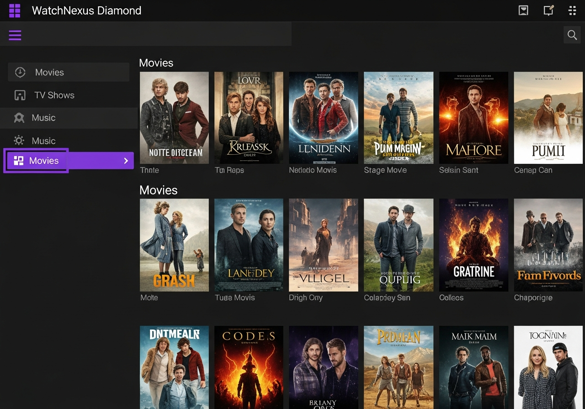

# WatchNexus Diamond - Kodi Addon 💎

**Codename:** Diamond  
**Version:** 1.0.0  
**Platform:** Kodi 19+ (Matrix/Nexus)

## Screenshots



## About

Diamond is the official WatchNexus addon for Kodi media center. It integrates your WatchNexus library directly into Kodi.

## Features

- Full library browsing
- Watch state sync
- Artwork integration
- Skip intro/credits
- Direct play and transcoding
- Multiple user support
- Music and audiobook support
- Native or Addon mode

## Installation

### From ZIP (Recommended)

1. Download `plugin.video.watchnexus+py3.zip`
2. In Kodi: Settings → Add-ons → Install from zip file
3. Select the downloaded file
4. Wait for "Add-on installed" notification

### From Repository (Coming Soon)

Add WatchNexus repository for automatic updates.

## Pre-built Package

The addon is pre-built and ready to install:
```
plugin.video.watchnexus+py3.zip
```

## Configuration

1. Go to Add-ons → WatchNexus Diamond
2. Open Settings (context menu)
3. Enter server URL: `http://your-server:8001`
4. Enter username and password
5. Select sync mode

## Sync Modes

### Addon Mode (Default)
Browse WatchNexus library within the addon.

### Native Mode
Sync to Kodi library for native browsing.

## Building from Source

```bash
cd watchnexus-diamond
pip install pyyaml
python build.py
# Output: plugin.video.watchnexus+py3.zip
```

## Server Requirements

- WatchNexus Server 2.4.0+

## License

GPL-2.0 (forked from jellyfin-kodi)
