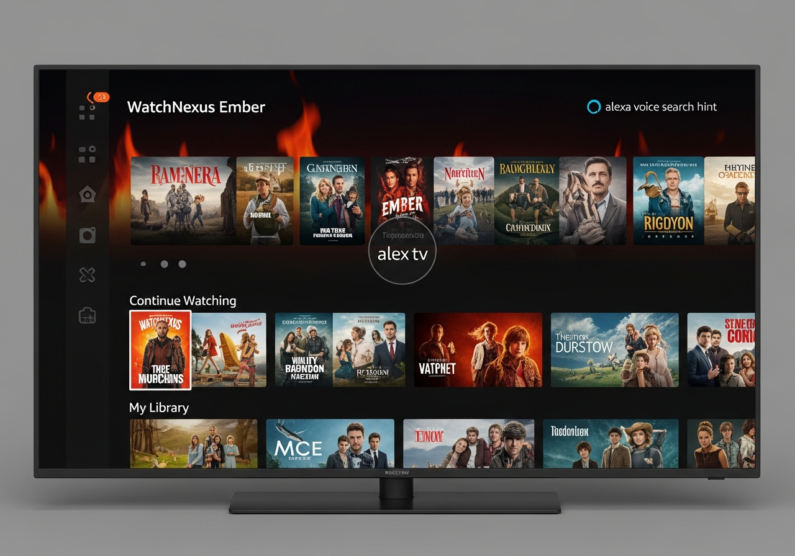

# WatchNexus Ember - Fire TV Client 🔥

**Codename:** Ember  
**Version:** 1.0.0  
**Platform:** Amazon Fire TV / Fire TV Stick

## Screenshots



## About

Ember is the WatchNexus client for Amazon Fire TV devices. It shares the same codebase as Ruby (Android TV) but is optimized for Fire TV's remote and interface.

## Features

- Native Fire TV interface
- Amazon remote optimized
- Alexa voice search (within app)
- Skip intro/credits
- Multiple audio/subtitle tracks
- Live TV support
- Continue watching
- Quick login on home network

## Building

### Requirements

- Android Studio (Electric Eel+)
- JDK 21
- Android SDK 34+

### Build Steps

```bash
# Clone repository
git clone https://github.com/watchnexus/watchnexus-ember.git
cd watchnexus-ember

# Build release APK
./gradlew assembleRelease
```

## Installation

### ADB Sideload
```bash
adb connect <fire-tv-ip>:5555
adb install app/build/outputs/apk/release/app-release.apk
```

### Downloader App
1. Install "Downloader" from Amazon Appstore
2. Enter URL to APK
3. Install

## Supported Devices

- Fire TV Stick (all generations)
- Fire TV Stick 4K / 4K Max
- Fire TV Cube
- Fire TV (box)
- Fire TV Edition smart TVs

## Configuration

1. Launch WatchNexus Ember
2. Enter server URL: `http://your-server:8001`
3. Select profile or login

## Server Requirements

- WatchNexus Server 2.4.0+

## License

GPL-2.0 (forked from jellyfin-androidtv)
