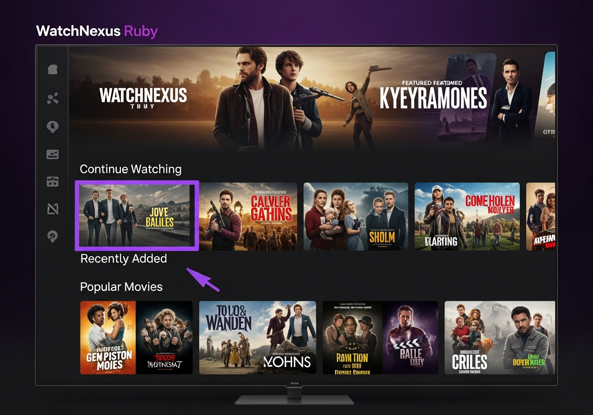

# WatchNexus Ruby - Android TV Client 💎

**Codename:** Ruby  
**Version:** 1.0.0  
**Platform:** Android TV (API 21+)

## Screenshots



## About

Ruby is the official WatchNexus client for Android TV and Google TV devices. It provides a native Leanback interface optimized for TV screens and remote controls.

## Features

- Native Android TV Leanback UI
- Voice search support
- Gamepad/remote navigation
- Skip intro/credits
- Multiple audio/subtitle tracks
- Live TV support
- Continue watching row
- User profiles
- Quick login (no password on home network)

## Building

### Requirements

- Android Studio (Electric Eel+)
- JDK 21
- Android SDK 34+

### Build Steps

```bash
# Clone repository
git clone https://github.com/watchnexus/watchnexus-ruby.git
cd watchnexus-ruby

# Build release APK
./gradlew assembleRelease

# APK location
ls app/build/outputs/apk/release/
```

## Installation

### Google Play (Coming Soon)
Search for "WatchNexus Ruby" on Google Play for Android TV.

### Sideload
```bash
adb install watchnexus-ruby-1.0.0.apk
```

## Configuration

1. Launch WatchNexus Ruby
2. Enter server URL: `http://your-server:8001`
3. Select your profile or login

## Server Requirements

- WatchNexus Server 2.4.0+

## License

GPL-2.0 (forked from jellyfin-androidtv)
