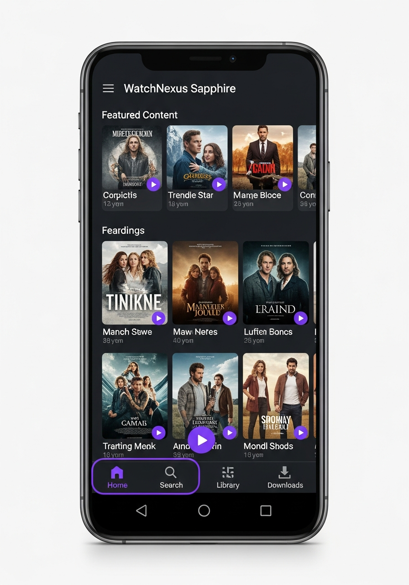

# WatchNexus Sapphire - Android Mobile Client 💎

**Codename:** Sapphire  
**Version:** 1.0.0  
**Platform:** Android 5.0+ (Lollipop)

## Screenshots



## About

Sapphire is the official WatchNexus client for Android phones and tablets. It features a modern Material Design 3 interface optimized for touch.

## Features

- Material Design 3 interface
- Offline downloads
- Background playback
- Picture-in-Picture
- Chromecast support
- Skip intro/credits
- Multiple audio/subtitle tracks
- Swipe gestures
- Quick login on home network

## Building

### Requirements

- Android Studio (Electric Eel+)
- JDK 21
- Android SDK 34+

### Build Steps

```bash
# Clone repository
git clone https://github.com/watchnexus/watchnexus-sapphire.git
cd watchnexus-sapphire

# Build release APK
./gradlew assembleRelease

# APK location
ls app/build/outputs/apk/release/
```

## Installation

### Google Play (Coming Soon)
Search for "WatchNexus Sapphire" on Google Play.

### Direct Download
Download APK and enable "Unknown Sources" to install.

## Configuration

1. Launch WatchNexus Sapphire
2. Tap "Add Server"
3. Enter: `http://your-server:8001`
4. Select profile or login

## Server Requirements

- WatchNexus Server 2.4.0+

## License

GPL-2.0 (forked from jellyfin-android)
