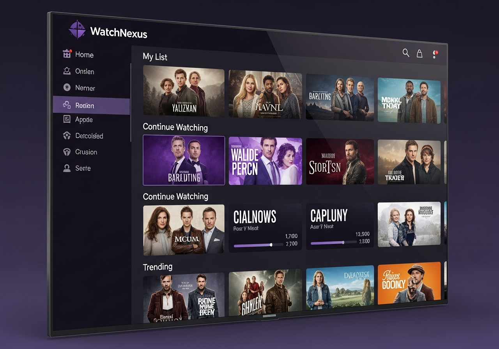

# WatchNexus Tanzanite - Roku Client 💜

**Codename:** Tanzanite  
**Version:** 1.0.0  
**Platform:** Roku OS 9.0+

## Screenshots



## About

Tanzanite is the official WatchNexus channel for Roku devices. Built with BrighterScript for optimal performance.

## Features

- Full library browsing with artwork
- Continue watching
- Search functionality
- Skip intro/credits support
- Subtitle selection
- Quality selection
- Multiple user profiles
- Quick login on home network

## Installation

### Sideloading (Development Mode)

1. Enable Developer Mode on Roku:
   - Go to Settings → System → About
   - Press: Home 3x, Up 2x, Right, Left, Right, Left, Right
   - Note your Roku's IP

2. Upload the Package:
   - Open browser: `http://<roku-ip>`
   - Login with developer credentials
   - Upload `tanzanite-roku.zip`
   - Click "Install"

### Roku Channel Store (Coming Soon)

Search for "WatchNexus" in the Roku Channel Store.

## Pre-built Package

The channel is pre-built and ready to sideload:
```
out/tanzanite-roku.zip
```

## Building from Source

```bash
cd watchnexus-tanzanite
npm install
npm run build
# Output: out/tanzanite-roku.zip
```

## Configuration

1. Launch WatchNexus Tanzanite
2. Enter server URL: `http://your-server:8001`
3. Select profile or login

## Remote Controls

| Button | Action |
|--------|--------|
| OK | Select / Play/Pause |
| Back | Go back / Exit |
| * | Options menu |
| Play/Pause | Toggle playback |
| Rewind/FF | Seek 10s |

## Server Requirements

- WatchNexus Server 2.4.0+

## License

GPL-2.0 (forked from jellyfin-roku)
